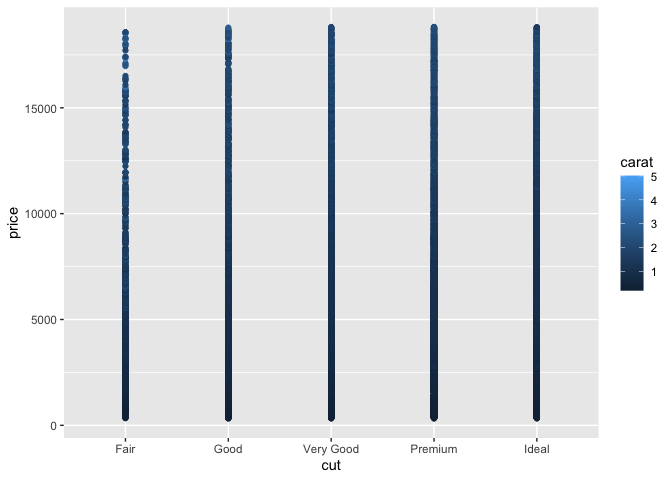
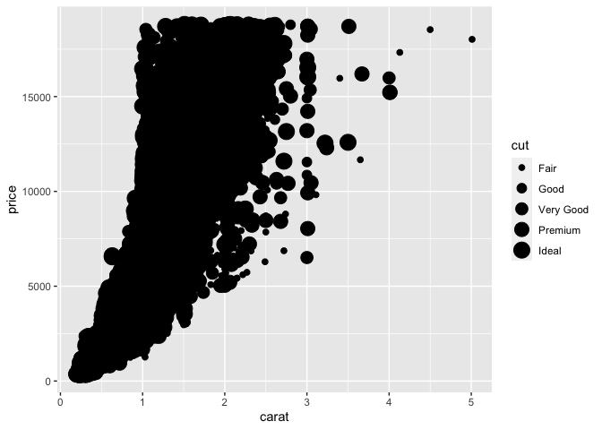

Getting Started: Diamonds
================
Hyegi Bang
2020-09-15

  - [Grading Rubric](#grading-rubric)
      - [Individual](#individual)
      - [Team](#team)
      - [Due Date](#due-date)
  - [Data Exploration](#data-exploration)
  - [Communication](#communication)
  - [Challenge Summary](#challenge-summary)

*Purpose*: Throughout this course, you’ll complete a large number of
*exercises* and *challenges*. Exercises are meant to introduce content
with easy-to-solve problems, while challenges are meant to make you
think more deeply about and apply the content. The challenges will start
out highly-scaffolded, and become progressively open-ended.

In this challenge, you will go through the process of exploring,
documenting, and sharing an analysis of a dataset. We will use these
skills again and again in each challenge.

<!-- include-rubric -->

# Grading Rubric

<!-- -------------------------------------------------- -->

Unlike exercises, **challenges will be graded**. The following rubrics
define how you will be graded, both on an individual and team basis.

## Individual

<!-- ------------------------- -->

| Category    | Unsatisfactory                                                                   | Satisfactory                                                               |
| ----------- | -------------------------------------------------------------------------------- | -------------------------------------------------------------------------- |
| Effort      | Some task **q**’s left unattempted                                               | All task **q**’s attempted                                                 |
| Observed    | Did not document observations                                                    | Documented observations based on analysis                                  |
| Supported   | Some observations not supported by analysis                                      | All observations supported by analysis (table, graph, etc.)                |
| Code Styled | Violations of the [style guide](https://style.tidyverse.org/) hinder readability | Code sufficiently close to the [style guide](https://style.tidyverse.org/) |

## Team

<!-- ------------------------- -->

| Category   | Unsatisfactory                                                                                   | Satisfactory                                       |
| ---------- | ------------------------------------------------------------------------------------------------ | -------------------------------------------------- |
| Documented | No team contributions to Wiki                                                                    | Team contributed to Wiki                           |
| Referenced | No team references in Wiki                                                                       | At least one reference in Wiki to member report(s) |
| Relevant   | References unrelated to assertion, or difficult to find related analysis based on reference text | Reference text clearly points to relevant analysis |

## Due Date

<!-- ------------------------- -->

All the deliverables stated in the rubrics above are due on the day of
the class discussion of that exercise. See the
[Syllabus](https://drive.google.com/file/d/15XBfRsGHdPokHUTbuBUzsSgqo0JCbUOB/view?usp=sharing)
for more information.

``` r
library(tidyverse)
```

    ## ── Attaching packages ───────────────────────────────────── tidyverse 1.3.0 ──

    ## ✓ ggplot2 3.3.2     ✓ purrr   0.3.4
    ## ✓ tibble  3.0.3     ✓ dplyr   1.0.2
    ## ✓ tidyr   1.1.2     ✓ stringr 1.4.0
    ## ✓ readr   1.3.1     ✓ forcats 0.5.0

    ## ── Conflicts ──────────────────────────────────────── tidyverse_conflicts() ──
    ## x dplyr::filter() masks stats::filter()
    ## x dplyr::lag()    masks stats::lag()

# Data Exploration

<!-- -------------------------------------------------- -->

In this first stage, you will explore the `diamonds` dataset and
document your observations.

**q1** Create a plot of `price` vs `carat` of the `diamonds` dataset
below. Document your observations from the visual.

*Hint*: We learned how to do this in `e-vis00-basics`\!

``` r
## TASK: Plot `price` vs `carat` below
## Your code here!
ggplot(diamonds) +
  geom_point(aes(x = carat, y = price))
```

<!-- -->

**Observations**:

  - (Write your observations here\!)
  - Generally, as the value of carat increases, the value of price
    increases, showing their linear/direct relationship.
  - As the value of carat gets higher, the variance in price also
    increases.

**q2** Create a visualization showing variables `carat`, `price`, and
`cut` simultaneously. Experiment with which variable you assign to which
aesthetic (`x`, `y`, etc.) to find an effective visual.

``` r
## TASK: Plot `price`, `carat`, and `cut` below
## Your code here!
ggplot(diamonds) +
  geom_point(aes(x = cut, y = price, color = carat))
```

<!-- -->

``` r
ggplot(diamonds) +
  geom_point(aes(x = carat, y = price, size = cut))
```

<!-- -->

``` r
ggplot(diamonds) +
  geom_point(aes(x = carat, y = price, color = cut))  
```

<!-- -->

**Observations**:

  - (Write your observations here\!)

In finding the most “effective” plot, I found that: \* Since “carat” and
“price” are quantitative value, whereas “cut” is a qualitative value,
having carat and price as the x-y element makes the plot more
“effective” as it shows carat and price’s linear relationship, \*
Adding “color” to the graph, better presents variance in price than the
previous, all-black plot.

Data-specific observations: \* On top of previous observations in terms
of price and carat, “Fair” cut diamonds are generally valued less than
“Ideal” cut diamonds \* Carat with smaller value, less than 2, tends
to be more categorized as “Premium” and “Ideal” cuts than carat with
bigger value.

# Communication

<!-- -------------------------------------------------- -->

In this next stage, you will render your data exploration and push it to
GitHub to complete your report.

**q3** *Knit* your document in order to create a report.

You can do this by clicking the “Knit” button at the top of your
document in RStudio.


This will create a local `.md` file, and RStudio will automatically open
a preview window so you can view your knitted document.

**q4** *Push* your knitted document to GitHub.


You will need to stage both the `.md` file, as well as the `_files`
folder. Note that the `_files` folder, when staged, will expand to
include all the files under that directory.


# Challenge Summary

<!-- -------------------------------------------------- -->

When you have completed this challenge, please write a summary about
your findings and [submit it
here](https://olin.qualtrics.com/jfe/form/SV_6sMhI2DEvNZBgXz). Remember
that this summary is one of the graded components of the course\!
